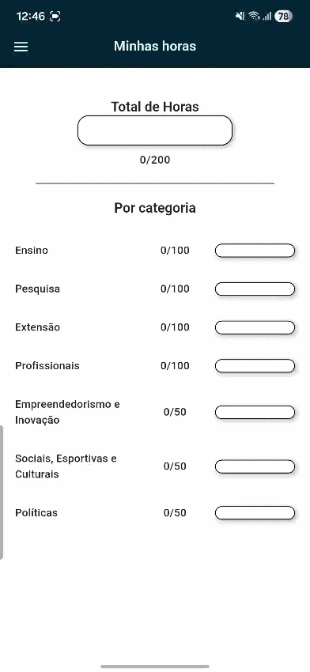

# 📱 Gerenciador de Atividades Complementares

Este é um projeto desenvolvido com o objetivo de auxiliar estudantes no controle de suas atividades complementares, permitindo um acompanhamento simples, organizado e eficiente das horas exigidas para a conclusão do curso.

O aplicativo foi recriado utilizando **Flutter**, com base em uma versão anterior desenvolvida em React Native, como parte do meu processo de aprendizado e evolução na tecnologia.

---

## 💡 Sobre o Projeto

A ideia surgiu ao perceber a dificuldade de estudantes do curso de Sistemas de Informação em organizar seus documentos e acompanhar o progresso das horas complementares exigidas.

Com base no barema disponibilizado pelo IFBA, o aplicativo foi desenvolvido para facilitar esse controle, permitindo que o usuário saiba exatamente quanto já cumpriu e o que ainda falta em cada categoria.

---

## 🚀 Tecnologias Utilizadas

- Flutter / Dart  
- GetIt (Injeção de dependência)  
- Isar (Banco de dados local)  
- BLoC (Gerenciamento de estado)  
- Dartz, Equatable e Mocktail (boas práticas e testes)  

---

## 🧱 Arquitetura

O projeto foi estruturado seguindo os princípios da **Clean Architecture**, dividido em três camadas principais:

### 📌 Presentation
Responsável pela interface com o usuário e gerenciamento de estados (BLoC).

### 📌 Domain
Contém as regras de negócio e as entidades da aplicação.

### 📌 Data
Responsável pela persistência e manipulação dos dados (Isar, datasources, repositories).

---

## ✨ Funcionalidades

- 📄 Cadastro e gerenciamento de documentos  
- ⏱️ Cálculo automático das horas acumuladas  
- 📊 Acompanhamento de progresso por categoria  
- 🔗 Armazenamento de links dos certificados  
- 📤 Geração e compartilhamento de relatório  

---

## 📸 Preview



---

## ⚙️ Como Executar o Projeto

```bash
# Clone o repositório
git clone https://github.com/WarrenCollins473/horas_compl_app.git

# Acesse a pasta
cd /horas_compl_app.git

# Instale as dependências
flutter pub get

# Execute o projeto
flutter run
```

---

## 🧪 Testes

```bash
flutter test
```

---

## 📌 Objetivo

Este projeto faz parte do meu processo de aprendizado em Flutter e tem como foco aplicar boas práticas de desenvolvimento, arquitetura limpa e organização de código.

---

## 🤝 Contribuições e Feedback

Fico totalmente aberto a sugestões, críticas e melhorias. Se quiser contribuir ou trocar ideias, será muito bem-vindo!

---
